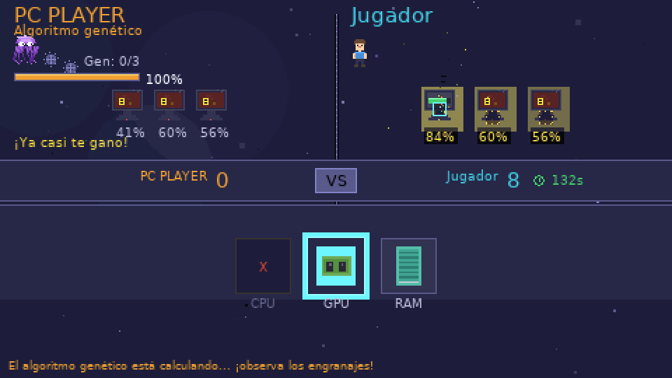
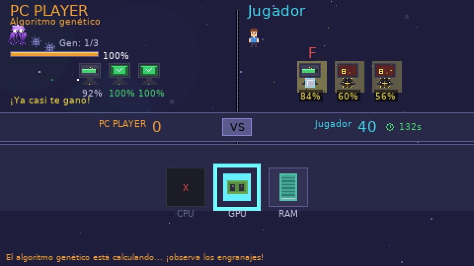
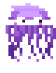

# PC Repair Challenge

Juego educativo de pixel-art que enseña el **Problema de Asignación Lineal** (LAP).
El jugador repara computadoras asignando componentes, mientras compite contra
un algoritmo genético..

Proyecto del laboratorio [OPTIMA](https://www.cicese.edu.mx) para la Noche de Ciencias.




## El problema

Cada computadora requiere un porcentaje de reparación y cada componente aporta
un porcentaje distinto en cada una, por lo que la asignación de las piezas es
determinante.

- Cada computadora acepta **una sola** pieza.
- Superar el 100 % desperdicia capacidad y penaliza el puntaje.
- Gana quien deje más computadoras al 100 % con menos desperdicio.

## Requisitos

- Linux (probado en Ubuntu/Debian y Fedora)
- Python 3.10 o superior

Dependencias: `pygame-ce` y `numpy` (`scipy` es opcional, solo acelera el audio).
Están declaradas en `requirements.txt`.

## Instrucciones de juego

En Linux:

```bash
./run.sh
```

`run.sh` crea un entorno virtual en `.venv`, instala las dependencias que
falten y ejecuta el juego. Equivale a:

```bash
python3 -m venv .venv
source .venv/bin/activate
pip install -r requirements.txt
python main.py
```

Controles:

| Tecla | Acción |
|---|---|
| `F11` | pantalla completa |
| `ESC` | menú |
| `M` | activar o silenciar el sonido |
| `G` | alternar entre los modos ultra fácil y normal |
| `DEL` / `Retroceso` | deshacer la última asignación |
| flechas + `ENTER` | asignar sin arrastrar |

El botón **↶ Deshacer** se encuentra en la esquina inferior derecha de la
partida, de modo que todas las acciones pueden realizarse con el ratón. El
botón se atenúa cuando no hay ninguna asignación que deshacer.

Se puede asignar una pieza arrastrándola hasta la computadora, o seleccionándola
y eligiendo la computadora con el teclado. Cada computadora admite un único
componente: si ya tiene pieza, el socket no acepta otra.

## ¿Quién gana?

- Gana quien termine con mayor puntaje.
- **Si el jugador alcanza la misma solución que el algoritmo, también gana.**
- Si el jugador iguala o supera la mejor solución disponible del algoritmo en ese
  momento, la ronda se decide inmediatamente, sin esperar a que el GA termine.
  El resultado indica si el jugador llegó antes, superó al algoritmo o si ambos
  encontraron la misma solución.

## Capturas



**PC PLAYER**, el algoritmo genético contra el que se compite:



## Modos de dificultad

El modo por defecto es **Normal**. En *Ajustes* se pueden elegir los cuatro, y
la tecla `G` alterna al instante entre **Ultra fácil** y **Normal**.

| Modo | Población | Generaciones | Tiempo |
|---|---|---|---|
| Ultra fácil | 35 % | 12 % (mínimo 3) | 220 % |
| Fácil | 70 % | 60 % | 150 % |
| Normal | 100 % | 100 % | 100 % |
| Difícil | 125 % | 130 % | 60 % |


## Ejecutable para Windows

El ejecutable de Windows requiere un equipo con Windows y Python instalado:

```bat
build_windows.bat
```

El `.exe` no requiere Python ni ninguna instalación adicional en el equipo
destino.

Los dos ejecutables quedan ordenados por sistema operativo:

```
dist/
  linux/     AppImage, .tar.gz, JUGAR.sh, LEEME.txt
  windows/   PCRepairChallenge.exe
```

## Ejecutable para Linux

```bash
./build_appimage.sh
```

También puede compilarse desde la pestaña **Actions** con el flujo **Linux**;
al publicar una etiqueta `v*` la AppImage y el paquete se adjuntan al mismo
Release que el `.exe`.

Genera los archivos en `dist/linux/`:

| Archivo | Descripción |
|---|---|
| `pc-repair-challenge-linux-x86_64.tar.gz` | **paquete de distribución**: contiene la AppImage, `JUGAR.sh` y `LEEME.txt` |
| `pc-repair-challenge-x86_64.AppImage` | AppImage aislada, para usuarios que saben ejecutarla |
| `JUGAR.sh` | lanzador, situado junto a la AppImage para probarla sin descomprimir |
| `LEEME.txt` | instrucciones de instalación para la persona que recibe la carpeta |

En el equipo destino se descomprime el `.tar.gz` y se ejecuta:

```bash
chmod +x JUGAR.sh
./JUGAR.sh
```

`JUGAR.sh` intenta abrir la AppImage directamente y, si el sistema no dispone de
FUSE, la extrae una sola vez en el directorio de datos del usuario y utiliza esa
copia en las ejecuciones siguientes. También puede ejecutarse con doble clic
tras marcarlo como ejecutable.

Comprobación de la AppImage sin abrir la ventana del juego:

```bash
./JUGAR.sh --test
```

Compatible con Linux x86-64 de escritorio (Ubuntu, Debian, Fedora, Mint). El
script descarga sus herramientas a `.cache/` en la primera ejecución, por lo que
requiere `curl` y conexión a internet en esa ejecución. Para regenerar el icono:
`python3 tools/make_icon.py`.

## Estructura

```
core/        problema de asignación y puntuación (sin dependencias de UI)
algorithm/   algoritmo genético (determinista con semilla)
game/        motor, estados, renderizado y tutorial
assets/      sprites de pixel-art y logos
ui/          efectos de pantalla: partículas, transiciones
audio/       música y efectos sintetizados
tests/       pruebas del juego
```

`core/` y `algorithm/` no importan pygame: son verificables por separado y
aceptan una semilla aleatoria para reproducir exactamente los mismos
resultados.

## Con el apoyo de


## Licencia

MIT. Ver [LICENSE](LICENSE).
